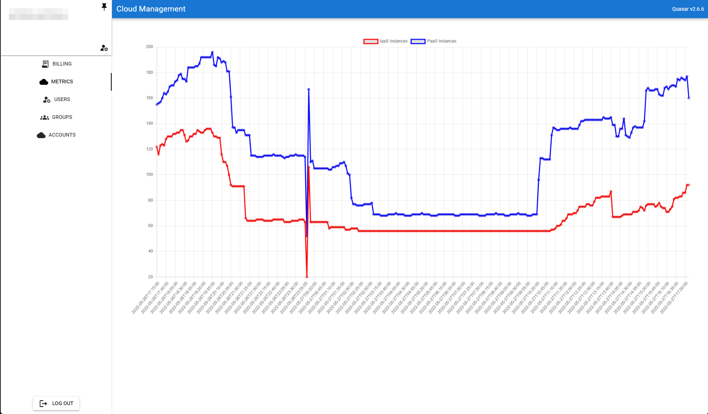

# Cloud Management
!Note: This should be considered alpha, there are many bugs!

Supported providers
* Amazon
* Azure (Note: doesn't currently report PaaS instances)
* Cloud OVH
* Bluemix
* CloudSigma
* Digital Ocean
* Heroku
* Various Jelastic providers
* Nexmo
* CloudOVH
* Rackspace
* SoftLayer

Adding a new account is extremely simple


The dashboard currently reports billed costs per period:.


Templates may be created to include/exclude/reorder accounts in an exported Excel document:


Currently the only captured metric is the number of alive instances:



# Deployment
`deploy.sh` should be all that is required to deploy this to a live environment. This will install and configure the following dependencies:
* Python 3.9
* Poetry
* npm
* Nginx
* Supervisord
* PostgreSQL 14

You may need to `chown nginx:nginx /var/run/uvicorn.sock` as Supervisord doesn't seem to always set the owner of the socket.

After this the project is built and placed in `/opt/cloudcost` and a config file generated in `/etc/cloudcost`.

# Setting up a dev environment
You will need the following:
* Python >=3.9, <3.11. (Greenlet currently fails on Python 3.11)
* Poetry
* npm
* PostgreSQL
* Redis

## Database
You must create a new database, and a new user with access to that database.
```
sudo -u postgres psql
CREATE USER <db_user> PASSWORD <db_password>;
CREATE DATABASE <db_name> OWNER <db_user>;
\d
```

## Backend
Navigate to `backend/app`.

Create an environment config file `config.json`
```
{
    "SERVER_NAME": "127.0.0.1",
    "SERVER_HOST": "https://127.0.0.1",
    "PROJECT_NAME": "cloudmgmt",

    "POSTGRES_SERVER": "localhost",
    "POSTGRES_USER": "db_user",
    "POSTGRES_PASSWORD": "db_password",
    "POSTGRES_DB": "db_name",

    "FIRST_USER_PASS": "admin_password",
    "SECRET_KEY": "jwt_secret"
}
```

Install the Python dependencies:
```
poetry install
```

Begin a shell in poetry
```
poetry shell
```

Seed the database with initial data
```
python -m app.init_data
```

Run the backend
```
uvicorn --host 127.0.0.1 --port 8000 --reload
```
If you change the port, you must change the proxy target in `frontend/quasar.config.js` to match.

Backend tests can be run with pytest
```
pytest .
```

# Frontend
Install the frontend's dependencies
```
npm install
```

Link quasar to access it's cli
```
npm link @quasar/cli
```

Run the development server
```
quasar dev
```